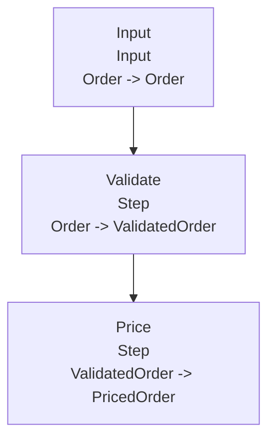
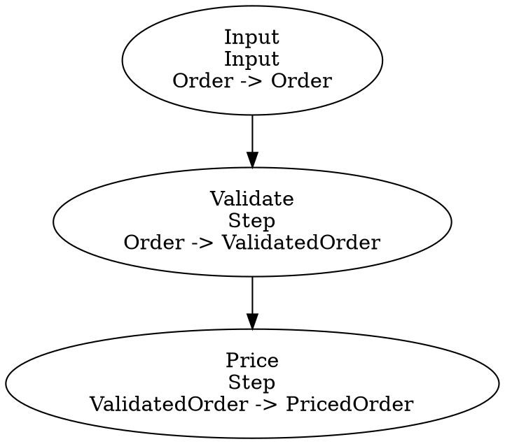

# Pipeliner.Net 


[](https://github.com/Emcrank/Pipeliner.Net/actions/workflows/ci.yml)
[](https://github.com/Emcrank/Pipeliner.Net/actions/workflows/release.yml)

A strongly typed, high-performance .NET pipeline framework with a fluent API for orchestrating complex workflows with branching, resilience, and streaming support.

## Why use Pipeliner.Net?

Pipeliner.Net is useful when you need to:

- compose multiple business steps into one reusable workflow,
- keep request flow strongly typed from input to output,
- run synchronous and asynchronous operations in the same pipeline,
- add resilience policies (like retries) around execution,
- process data in batches,
- branch, fork, and merge workflow paths.

Typical use cases:

- API request processing pipelines,
- ETL and transformation workflows,
- command and validation orchestration,
- integration workflows that call multiple external systems,
- background job processing with explicit, testable steps.

## Installation

```bash
dotnet add package Pipeliner.Net
```

## Quick start

```csharp
var pipeline = Pipeline
    .For<string>()
    .Then<int>(value => int.Parse(value))
    .Branch(
        value => value >= 0,
        value => value,
        _ => 0)
    .Then<int>(value => value * 2)
    .ThenAsync<int>(async (value, cancellationToken) =>
    {
        await Task.Delay(25, cancellationToken);
        return value + 10;
    })
    .Build("Quick start workflow");

var result = await pipeline.RunAsync("50");
Console.WriteLine(result);
// 110
```

## Core concepts

### OperationPipeline<TParam, TResult>

`OperationPipeline<TParam, TResult>` is the runtime pipeline type produced by the builder.

Use it for execution:

- `Run(...)` and `RunAsync(...)`
- `RunBatchAsync(...)`

### Pipeline.For<TInput>() builder

`Pipeline.For<TInput>()` is the entry point for pipeline composition and produces an `OperationPipeline` via `Build()`.

Use it for all pipeline definitions in application code.

## Fluent builder examples

### 1) Typed synchronous + asynchronous chain

```csharp
var pipeline = Pipeline
    .For<string>()
    .Then<int>(Convert.ToInt32)
    .ThenAsync<int>(async (value, cancellationToken) =>
    {
        await Task.Delay(25, cancellationToken);
        return value + 5;
    })
    .Build("Parse and increment");

var result = await pipeline.RunAsync("10");
// 15
```

### 2) Factory-based step registration

```csharp
public sealed class AddTaxStep : IPipelineStep<decimal, decimal>
{
    public ValueTask<decimal> ExecuteAsync(decimal input, CancellationToken cancellationToken = default) =>
        ValueTask.FromResult(input * 1.2m);
}

var pipeline = Pipeline
    .For<decimal>()
    .Then<AddTaxStep, decimal>(() => new AddTaxStep())
    .Build();

var total = pipeline.Run(100m);
// 120.0
```

### 3) Step-level retry policy

```csharp
var pipeline = Pipeline
    .For<int>()
    .ThenAsync(
        async (value, cancellationToken) =>
        {
            await Task.Delay(5, cancellationToken);
            return value + 1;
        },
        StepExecutionOptions.WithPolicy(new RetryExecutionPolicy(3)))
    .Build();
```

### 4) Step-level concurrency and rate limiting

```csharp
using System.Threading.RateLimiting;

var limiter = new TokenBucketRateLimiter(
    new TokenBucketRateLimiterOptions
    {
        TokenLimit = 100,
        TokensPerPeriod = 100,
        ReplenishmentPeriod = TimeSpan.FromMinutes(1),
        QueueLimit = 250,
        AutoReplenishment = true
    });

var pipeline = Pipeline
    .For<Order>()
    .ThenAsync(
        "Send to ERP",
        SendToErpAsync,
        StepExecutionOptions.Create(
            maxConcurrency: 4,
            rateLimiter: limiter))
    .Build();
```

A rejected rate-limit lease throws `PipelineRateLimitRejectedException`.

### 5) Saga compensation

```csharp
var pipeline = Pipeline
    .For<CreateOrderCommand>()
    .ThenSaga(
        "Reserve inventory",
        ReserveInventoryAsync,
        (reservation, cancellationToken) => ReleaseInventoryAsync(reservation.Id, cancellationToken))
    .ThenSaga(
        "Capture payment",
        CapturePaymentAsync,
        (payment, cancellationToken) => RefundPaymentAsync(payment.Id, cancellationToken))
    .Build("Create order");
```

If a later step fails, completed saga compensations run in reverse order. If compensation itself fails, `PipelineSagaCompensationException` exposes the original pipeline exception and all compensation failures.

### 6) Per-run state

```csharp
public sealed class OrderState
{
    public int Attempts { get; set; }
    public DateTimeOffset? ValidatedAt { get; set; }
}

var pipeline = Pipeline
    .For<Order>()
    .WithState(() => new OrderState())
    .ThenAsync("Validate", async (order, state, cancellationToken) =>
    {
        state.Attempts++;
        state.ValidatedAt = DateTimeOffset.UtcNow;
        return await ValidateAsync(order, cancellationToken);
    })
    .Then("Apply state", (order, state) => order with { Attempts = state.Attempts })
    .Build("Stateful order workflow");
```

State is created once per pipeline run, so concurrent executions do not share mutable state.

### 7) Pipeline-level execution policy

```csharp
var pipeline = Pipeline
    .For<int>()
    .ThenAsync<int>((value, _) => ValueTask.FromResult(value + 1))
    .WithPolicy(new RetryExecutionPolicy(2))
    .Build();
```

### 8) Dynamic routing

```csharp
var pipeline = Pipeline
    .For<Payment>()
    .RouteBy<PaymentMethod, PaymentResult>(
        "Payment method route",
        payment => payment.Method,
        routes => routes
            .When(PaymentMethod.Card, ChargeCard)
            .WhenAsync(PaymentMethod.BankTransfer, StartBankTransferAsync)
            .Default(payment => PaymentResult.Rejected(payment.Id)))
    .Build();
```

If no route matches and no default route is configured, `PipelineRouteNotFoundException` is thrown.

### 9) Branch and branch async

```csharp
var pipeline = Pipeline
    .For<int>()
    .Branch(
        value => value >= 0,
        value => value,
        _ => 0)
    .BranchAsync(
        value => value > 100,
        (value, _) => ValueTask.FromResult($"large:{value}"),
        (value, _) => ValueTask.FromResult($"small:{value}"))
    .Build();

var label = await pipeline.RunAsync(150);
// large:150
```

### 10) Fork + merge (custom reducer)

```csharp
var pipeline = Pipeline
    .For<decimal>()
    .Fork<decimal>(
        (amount, _) => ValueTask.FromResult(amount + 5m),
        (amount, _) => ValueTask.FromResult(amount * 1.08m),
        (amount, _) => ValueTask.FromResult(amount - 3m))
    .Merge<decimal, decimal>((results, _) => ValueTask.FromResult(results.Sum()), MergeStepOptions.CustomReducer())
    .Build("Price workflow");

var finalPrice = await pipeline.RunAsync(120m);
Console.WriteLine(finalPrice);
// 371.6
```

### 11) Built-in merge strategy: throw on any failure

```csharp
var pipeline = Pipeline
    .For<int>()
    .Fork<int>(
        (value, _) => ValueTask.FromResult(value + 1),
        (_, _) => ValueTask.FromException<int>(new InvalidOperationException("branch failed")),
        (value, _) => ValueTask.FromResult(value + 3))
    .Merge<int, IReadOnlyList<int>>(
        (results, _) => ValueTask.FromResult<IReadOnlyList<int>>(results),
        MergeStepOptions.ThrowOnAnyFailure())
    .Build();

await Assert.ThrowsAsync<AggregateException>(() => pipeline.RunAsync(10));
```

### 12) Built-in merge strategy: ignore failures

```csharp
var pipeline = Pipeline
    .For<int>()
    .Fork<int>(
        (value, _) => ValueTask.FromResult(value + 1),
        (_, _) => ValueTask.FromException<int>(new InvalidOperationException("branch failed")),
        (value, _) => ValueTask.FromResult(value + 3))
    .Merge<int, IReadOnlyList<int>>(
        (results, _) => ValueTask.FromResult<IReadOnlyList<int>>(results),
        MergeStepOptions.IgnoreFailures())
    .Build();

var results = await pipeline.RunAsync(10);
// [11, 13]
```

### 13) Built-in merge strategy: take first

```csharp
var pipeline = Pipeline
    .For<int>()
    .Fork<int>(
        (value, _) => ValueTask.FromResult(value + 1),
        (value, _) => ValueTask.FromResult(value + 2))
    .Merge<int, int>(
        (results, _) => ValueTask.FromResult(results[0]),
        MergeStepOptions.TakeFirst())
    .Build();

var first = await pipeline.RunAsync(10);
// 11
```

### 14) Parallel projection

```csharp
var pipeline = Pipeline
    .For<int[]>()
    .ThenParallel<int, int>(
        (value, _) => ValueTask.FromResult(value * value),
        ParallelStepOptions.Create(4))
    .Build();

var squares = await pipeline.RunAsync([1, 2, 3, 4]);
// [1, 4, 9, 16]
```

## Batch execution

### Batch from memory

```csharp
var pipeline = Pipeline
    .For<string>()
    .Then<int>(Convert.ToInt32)
    .Then<int>(value => value + 1)
    .Build();

var results = await pipeline.RunBatchAsync(new[] { "1", "2", "3" });
// [2, 3, 4]
```

### Batch from IAsyncEnumerable<T>

```csharp
static async IAsyncEnumerable<string> GetInputsAsync()
{
    yield return "10";
    await Task.Yield();
    yield return "20";
}

var pipeline = Pipeline
    .For<string>()
    .Then<int>(Convert.ToInt32)
    .Then<int>(value => value + 5)
    .Build();

await foreach (var item in pipeline.RunBatchAsync(GetInputsAsync()))
{
    Console.WriteLine(item);
}
```

## Checkpoints and persistence

Checkpoints let a request-response pipeline persist the current value at explicit points in the workflow. They are useful for debugging production failures, auditing important intermediate states, preserving expensive transformation results, and preparing for manual recovery scenarios.

Checkpointing is opt-in:

- add one or more `.Checkpoint(...)` calls,
- configure persistence with `.WithCheckpointing(...)`,
- make sure the value at each checkpoint can be serialized with `System.Text.Json`.

Pipelines without checkpoints are unaffected. Only the value flowing through an explicit checkpoint needs to be JSON-serializable.

Checkpointing is currently for `Pipeline.For<TInput>()` request-response pipelines. Stream pipelines are excluded from durable execution v1.

### In-memory checkpoints

`InMemoryPipelineCheckpointStore` is useful for tests, local diagnostics, and short-lived processes.

```csharp
var store = new InMemoryPipelineCheckpointStore();

var pipeline = Pipeline
    .For<string>()
    .Then("Parse", int.Parse)
    .Checkpoint("After parse")
    .Then("Increment", value => value + 1)
    .WithCheckpointing(store)
    .Build("Checkpointed parse workflow");

var result = await pipeline.RunAsync("41");
// 42

var checkpoints = await store.LoadByPipelineAsync(pipeline.Id);

foreach (var checkpoint in checkpoints)
{
    Console.WriteLine($"{checkpoint.CheckpointName}: {checkpoint.PayloadJson}");
}
```

### File-backed checkpoints

`FilePipelineCheckpointStore` stores checkpoint records as JSON files.

```csharp
var store = new FilePipelineCheckpointStore("./checkpoints");

var pipeline = Pipeline
    .For<Order>()
    .Then("Validate", ValidateOrder)
    .Checkpoint("After validation")
    .ThenAsync("Submit to ERP", SubmitToErpAsync)
    .WithCheckpointing(store)
    .Build("Order submission");

await pipeline.RunAsync(order, cancellationToken);
```

Each saved checkpoint includes:

- run ID,
- pipeline ID and name,
- checkpoint name,
- checkpoint node ID,
- payload type,
- JSON payload,
- creation timestamp.

You can load checkpoints for a specific run or all checkpoints for a pipeline:

```csharp
IReadOnlyList<PipelineCheckpoint> runCheckpoints =
    await store.LoadAsync(runId, cancellationToken);

IReadOnlyList<PipelineCheckpoint> pipelineCheckpoints =
    await store.LoadByPipelineAsync(pipeline.Id, cancellationToken);
```

### Checkpoint failure behavior

Checkpoint persistence failures fail the pipeline run by default. This is the safest behavior for workflows where a checkpoint is part of the reliability contract.

```csharp
var pipeline = Pipeline
    .For<Order>()
    .Then("Validate", ValidateOrder)
    .Checkpoint("After validation")
    .WithCheckpointing(
        store,
        PipelineCheckpointFailureBehavior.FailRun)
    .Build();
```

If checkpoint persistence is best-effort for your workflow, configure the pipeline to continue when checkpoint storage fails:

```csharp
var pipeline = Pipeline
    .For<Order>()
    .Then("Validate", ValidateOrder)
    .Checkpoint("After validation")
    .WithCheckpointing(
        store,
        PipelineCheckpointFailureBehavior.Continue)
    .Build();
```

### Custom checkpoint stores

Implement `IPipelineCheckpointStore` to persist checkpoints in a database, blob store, document database, queue, or another durable system.

```csharp
public sealed class SqlPipelineCheckpointStore : IPipelineCheckpointStore
{
    private readonly string connectionString;

    public SqlPipelineCheckpointStore(string connectionString)
    {
        this.connectionString = connectionString;
    }

    public async ValueTask SaveAsync(
        PipelineCheckpoint checkpoint,
        CancellationToken cancellationToken = default)
    {
        // Insert checkpoint.RunId, checkpoint.PipelineId,
        // checkpoint.CheckpointName, checkpoint.PayloadType,
        // checkpoint.PayloadJson, and checkpoint.CreatedAt.
        await SaveCheckpointRowAsync(connectionString, checkpoint, cancellationToken);
    }

    public async ValueTask<IReadOnlyList<PipelineCheckpoint>> LoadAsync(
        string runId,
        CancellationToken cancellationToken = default)
    {
        // Return all checkpoints for one pipeline run, ordered by creation time.
        return await LoadCheckpointRowsForRunAsync(connectionString, runId, cancellationToken);
    }

    public async ValueTask<IReadOnlyList<PipelineCheckpoint>> LoadByPipelineAsync(
        string pipelineId,
        CancellationToken cancellationToken = default)
    {
        // Return all checkpoints for one pipeline definition, ordered by creation time.
        return await LoadCheckpointRowsForPipelineAsync(connectionString, pipelineId, cancellationToken);
    }
}
```

Then use it like any built-in store:

```csharp
var store = new SqlPipelineCheckpointStore(connectionString);

var pipeline = Pipeline
    .For<OrderImport>()
    .Then("Normalize", NormalizeImport)
    .Checkpoint("After normalization")
    .ThenAsync("Persist", PersistImportAsync)
    .WithCheckpointing(PipelineCheckpointOptions.FailRun(store))
    .Build("Import workflow");
```

## Stream execution with backpressure

### Stream builder quick start

```csharp
var streamPipeline = Pipeline
    .StreamFor<string>()
    .Then<int>(int.Parse)
    .ThenAsync<int>(async (value, cancellationToken) =>
    {
        await Task.Delay(10, cancellationToken);
        return value + 1;
    })
    .Build("Stream parse and increment");

await foreach (var item in streamPipeline.RunStreamAsync(GetInputsAsync()))
{
    Console.WriteLine(item);
}
```

### Configure bounded channel backpressure

```csharp
var streamPipeline = Pipeline
    .StreamFor<int>()
    .WithBackpressure(BackpressureOptions.Create(256, BackpressureMode.Wait))
    .Then<int>(value => value * 2)
    .Build();
```

### Batch and window stream items

```csharp
var batchedPipeline = Pipeline
    .StreamFor<OrderCreated>()
    .Batch(size: 100, maxDelay: TimeSpan.FromSeconds(5))
    .ThenAsync<ImportResult>(ImportBatchAsync)
    .Build("Order import batches");

await foreach (var result in batchedPipeline.RunStreamAsync(events, cancellationToken))
{
    Console.WriteLine(result.ImportedCount);
}
```

```csharp
var windowedPipeline = Pipeline
    .StreamFor<MetricPoint>()
    .Window(TimeSpan.FromSeconds(10))
    .Then(window => window.Average(point => point.Value))
    .Build("Metric windows");
```

Available backpressure modes:

- `BackpressureMode.Wait`
- `BackpressureMode.DropNewest`
- `BackpressureMode.DropOldest`
- `BackpressureMode.DropWrite`

## MergeReducers helper

Use `MergeReducers` directly when you need custom aggregation over detailed branch outcomes (`ForkResult<T>`):

```csharp
var forkPipeline = Pipeline
    .For<int>()
    .Fork<int>(
        (value, _) => ValueTask.FromResult(value + 1),
        (_, _) => ValueTask.FromException<int>(new InvalidOperationException("branch failed")),
        (value, _) => ValueTask.FromResult(value + 3))
    .Build();

var forkExecution = await forkPipeline.RunAsync(10);

var reduced = await MergeReducers.ReduceAsync(
    forkExecution.BranchResults,
    0,
    (acc, value, _) => ValueTask.FromResult(acc + value));

Console.WriteLine(reduced);
// 24
```

## Dependency injection friendly operations

```csharp
var pipeline = Pipeline
    .For<int>()
    .Then<MyServiceStep, int>(() => new MyServiceStep(serviceProvider.GetRequiredService<MyService>()))
    .Build();

public sealed class MyServiceStep(MyService service) : IPipelineStep<int, int>
{
    public ValueTask<int> ExecuteAsync(int input, CancellationToken cancellationToken = default) =>
        ValueTask.FromResult(service.Transform(input));
}
```

## Pipeline descriptions and visualization

Built pipelines expose structural metadata through `Describe()`. Named overloads make exported graphs readable for documentation, diagnostics, pull request notes, architecture diagrams, or UI rendering.

`PipelineDefinition` contains:

- pipeline ID and name,
- graph nodes,
- graph edges,
- node kinds,
- step input/output types.

Request-response pipelines and stream pipelines both expose `Describe()`.

```csharp
var pipeline = Pipeline
    .For<Order>()
    .Then("Validate", ValidateOrder)
    .ThenAsync("Price", PriceOrderAsync)
    .Branch(
        "Route by risk",
        order => order.RiskScore > 80,
        high => high with { ReviewRequired = true },
        low => low)
    .Build("Order workflow");

var definition = pipeline.Describe();
```

### Export as JSON

Use `ToJson()` when you want to store, inspect, diff, or render the pipeline definition in another tool.

```csharp
string json = definition.ToJson();

Console.WriteLine(json);
```

Example output:

```json
{
  "id": "4f4e7b8f-2c2e-4f2f-9f5d-4b90f9f2c99f",
  "name": "Order workflow",
  "nodes": [
    {
      "id": "input",
      "name": "Input",
      "kind": "Input",
      "inputType": "Order",
      "outputType": "Order"
    },
    {
      "id": "step_1",
      "name": "Validate",
      "kind": "Step",
      "inputType": "Order",
      "outputType": "ValidatedOrder"
    }
  ],
  "edges": [
    {
      "from": "input",
      "to": "step_1",
      "label": null
    }
  ]
}
```

You can pass custom `JsonSerializerOptions` if you want different formatting:

```csharp
string compactJson = definition.ToJson(
    new JsonSerializerOptions { WriteIndented = false });
```

### Export as Mermaid

Use `ToMermaid()` when you want Markdown-friendly diagrams for GitHub, documentation sites, or generated architecture notes.

```csharp
string mermaid = definition.ToMermaid();

Console.WriteLine(mermaid);
```

Example output:



You can paste the generated Mermaid into Markdown renderers that support Mermaid diagrams.

### Export as Graphviz DOT

Use `ToDot()` when you want to render the pipeline graph with Graphviz or other tooling that understands DOT files.

```csharp
string dot = definition.ToDot();

await File.WriteAllTextAsync("order-workflow.dot", dot, cancellationToken);
```

Example output:



A DOT file can be rendered with Graphviz:

```bash
dot -Tpng order-workflow.dot -o order-workflow.png
```

## Step tracing

Use `RunWithTrace(...)` or `RunWithTraceAsync(...)` to execute a pipeline and capture per-step timing metadata for fluent steps.

```csharp
var run = await pipeline.RunWithTraceAsync(input, cancellationToken);

Console.WriteLine(run.Result);

foreach (var step in run.Trace.Steps)
{
    Console.WriteLine($"{step.Name}: {step.Duration.TotalMilliseconds}ms");
}
```

Trace entries include the step name, kind, input/output types, duration, success flag, and exception type when captured around a failing step.

## Dry-run validation

Use `DryRun()` to validate the captured pipeline structure without executing any step delegates or side effects.

```csharp
var report = pipeline.DryRun();

if (!report.IsValid)
{
    foreach (var issue in report.Issues)
    {
        Console.WriteLine($"{issue.Severity}: {issue.Code} - {issue.Message}");
    }
}
```

Dry-run validation checks graph consistency, missing edge endpoints, duplicate node IDs, and unreachable nodes.

## Observability

`OperationPipeline` emits:

- `ActivitySource` spans using source name `Pipeliner.Net`,
- `Meter` metrics:
  - `pipeliner.pipeline.runs`
  - `pipeliner.pipeline.failures`
  - `pipeliner.pipeline.duration.ms`
  - `pipeliner.pipeline.operation.duration.ms`

This integrates cleanly with OpenTelemetry collectors and exporters.

## Error handling model

- Per-operation exception handling via `onExceptionHandler`.
- Unhandled exceptions bubble to caller.
- Retry and similar behavior can be applied via `IPipelineExecutionPolicy`.

## Testing guidance

Pipelines are easy to unit test because:

- each step is just a delegate or `IPipelineStep`,
- full flow can be executed in-memory,
- branch/fork/merge behavior is deterministic and explicit.

## Roadmap alignment

Current API includes:

- async-first delegates with `ValueTask`,
- typed fluent composition,
- batch APIs,
- streaming APIs with channel-backed backpressure,
- policy hooks,
- branch/fork/merge capabilities,
- built-in merge conflict strategies and reducers,
- instrumentation support.

Future phases can expand higher-level integration helpers and additional execution policies without breaking request-response usage.
